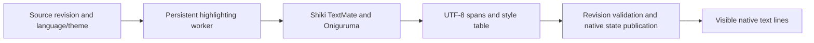

# Making Shiki usable in GPUI

Date: 2026-09-07. Status: implementation research with executable runtime probes; no production integration or native rendering benchmark has been completed.

## Recommendation

Use upstream Shiki as a tokenization service and render its output with GPUI's native text APIs. Start with a read-only code block on the Bun runtime using the Oniguruma engine. This preserves the grammar/theme implementation and avoids a full Rust port. Make the service interface independent of the runtime so a Rust application can use a different implementation later.

Do not advertise broad support in this repository's QuickJS runtime yet: the actual rquickjs 0.12.2 probe fails TypeScript, TSX, and Markdown with `too many captures`. Do not select the JavaScript engine merely because a runtime accepts the `d` and `v` flags. The Bun automatic-target probe also exposes a concrete token mismatch after an emoji-containing TypeScript string. Oniguruma is the baseline for this integration; JS engine substitution needs a qualified language/runtime matrix.

For an application that must remain native Rust with no JavaScript runtime, evaluate Giallo before writing a new tokenizer. It is not a drop-in MIT replacement: its EUPL-1.2 declaration and its public API's full-input highlighting model are separate adoption constraints. For a QuickJS application requiring upstream Shiki semantics, a native Oniguruma scanner behind Shiki's custom engine interface is the most targeted architectural experiment. Neither alternative was implemented here. See [upstream research](upstream-research.md) for pinned source evidence.

## What is being ported

There are three distinct outcomes:

| Outcome | Work required | Recommendation |
| --- | --- | --- |
| Shiki-colored native code display | Run Shiki, convert tokens into native styles, retain original text | First deliverable |
| Editable GPUI code editor using Shiki | Add document sessions, incremental checkpoints, asynchronous results and editor invalidation | Second, separate milestone |
| Rust implementation compatible with Shiki | Reimplement or adopt TextMate grammar execution, Oniguruma matching, theme precedence, asset loading and state | Only if runtime/deployment constraints require it |

HTML rendering, CSS selectors, DOM transformers, Twoslash popovers, and Magic Move do not become GPUI capabilities by adapting tokens. Likewise, TextMate syntax coloring does not provide LSP semantic tokens, diagnostics, navigation, completion, or a folding parser. These would be separate native features.

Shiki explicitly supports custom rendering through token APIs. Its tokenization and regex layers are separable, including a token-only `@shikijs/primitive` package in the inspected release. The probe uses the more convenient `shiki/core` API; switching to primitive should follow a measured bundle/API benefit. [Pinned upstream architecture and contracts](upstream-research.md#direct-integration-boundary)

## Local architecture and integration seams

The working tree contained extensive pre-existing changes. Research used HEAD `696660354ed75a838b7a80124ebb6ba3779b0653` plus the current dirty files, not HEAD alone. No existing product files were changed. The current workspace declares `gpui-pre 0.3.3` and patches it to `vendor/gpui`; the old GPUI pin recorded in ADR-0013 is historical evidence, not the linked implementation. The host pins rquickjs `=0.12.2`. [Workspace manifest](../../Cargo.toml), [host manifest](../../crates/solid-gpui/Cargo.toml), [recorded file hashes](probe/environment.json)

| Existing seam | What it already does | Required Shiki work |
| --- | --- | --- |
| GPUI `TextRun` and `HighlightStyle` | UTF-8 byte lengths, font, foreground, background, underline and strikethrough | Convert resolved token styles and validate byte boundaries |
| Solid `Text` with direct nested `Text` runs | Assembles one shaped paragraph; native selection and copy | Convenient small-snippet adapter; each token still adds Host Nodes and wire work |
| Base `TextView::code_block_highlighter` | Synchronous callback returning styled byte ranges | Consume prepared cached results; avoid running Shiki during rendering |
| Base `InputHighlighter` | Owns parsing state, accepts edits, returns styles for a requested range | Session-backed implementation with asynchronous update and bounded range lookup |
| Solid native `TextView` / `Editor` components | Existing retained native state and generated native contracts | Expose explicit highlighting configuration; current props do not accept Shiki results/services |

Sources: [TextRun](../../vendor/gpui/src/text_system.rs), [HighlightStyle](../../vendor/gpui/src/style.rs), [rich paragraph painter](../../crates/solid-gpui/src/renderer/paint/text_input.rs), [ADR-0013](../../docs/adr/0013-interactive-text-runs.md), [Base TextView](../../vendor/gpui-component/crates/base/src/text/text_view.rs), [InputHighlighter](../../vendor/gpui-component/crates/base/src/input/editor/highlighting.rs), [native rich text adapter](../../crates/solid-gpui/src/components/rich_text.rs), [native editor adapter](../../crates/solid-gpui/src/components/input.rs).

**A specific asynchronous cache hazard:** Base `CodeBlock::highlighted_styles` memoizes by the callback's `Arc` identity. If the callback initially returns no styles while a worker computes them, updating a shared map and notifying the view does not invalidate this cache. Replace the callback identity when a completed generation is published, or refactor this seam to use an explicit highlight-result revision. Keep one identity per generation; constructing a callback on every frame defeats caching. This is a necessary integration change, not a speculative optimization. [CodeBlock cache implementation](../../vendor/gpui-component/crates/base/src/text/node.rs)

`InputHighlighter::styles` requires ordered, non-overlapping ranges fully covering the requested range. Its parser-independent API permits pre-resolved Shiki styles. Preserve the Host-Owned Input Model: Rust owns text editing, IME, selection, caret and undo; the worker receives immutable text revisions and returns decorations. A highlighter's asynchronous completion must also invalidate the editor's affected layout/style state, not merely mutate a map. That exact publication seam remains to be implemented and tested. [Input highlighter contract](../../vendor/gpui-component/crates/base/src/input/editor/highlighting.rs), [domain invariants](../../CONTEXT.md)

## Executed probes

Pinned npm dependency: Shiki 4.4.2, with the exact dependency graph in [package-lock.json](probe/package-lock.json). Platform: macOS arm64; Bun 1.4.2; Node v24.20.0. The standalone Rust harness uses the same rquickjs version, 256 MiB VM memory limit, 2 MiB JS stack and 8 MiB worker stack as the host. It uses `Context::full`, not the actual Solid runtime bootstrap, transport or window.

The JavaScript-engine bundle includes TypeScript, TSX, Rust, JSON, Markdown and GitHub light/dark themes. Bun built 87 modules into approximately 0.79 MB of unminified JavaScript. This is the probe's file size, not installed package size, compressed distribution size or resident memory.

| Execution | Observed result |
| --- | --- |
| Bun, JS engine, explicit ES2018 target | Five source-reconstruction cases pass; multiline continuation and theme change pass |
| QuickJS, JS engine, ES2018 target | Rust/JSON samples pass; TypeScript/TSX/Markdown throw `SyntaxError: too many captures` |
| QuickJS, JS engine, automatic target | Same failures; both regex `d` and `v` are supported; WebAssembly is absent |
| Bun, Oniguruma versus JS ES2018 | Exact token arrays match on all five fixtures; UTF-8 range reconstruction preserves all original bytes |
| Bun, Oniguruma versus JS automatic target | TypeScript fixture differs after an emoji-containing string; four other fixtures match |
| Node, Oniguruma versus JS automatic target | All five fixtures match |

Raw evidence: [Bun JS](probe/bun-result.json), [QuickJS ES2018](probe/quickjs-result.json), [QuickJS auto](probe/quickjs-auto-result.json), [Bun Oniguruma/ES2018 comparison](probe/oniguruma-es2018-result.json), [Bun automatic-target difference](probe/oniguruma-result.json), [Node comparison](probe/node-oniguruma-result.json).

The QuickJS source packaged with rquickjs-sys 0.12.2 defines `CAPTURE_COUNT_MAX 255` in `quickjs/libregexp.c` and throws this error at the parser limit. The issue is not missing Unicode-set support. Increasing the JS memory or stack limits does not remove a fixed regex representation limit; this research did not modify QuickJS. [Runtime harness](probe/quickjs/src/main.rs), [environment/source hashes](probe/environment.json)

The Bun automatic-target mismatch is a reproducible configuration-specific observation, not a root-cause attribution to Bun, Shiki or the converter. The failing sample is `const 名称 = "😀é";` followed by a CRLF-delimited multiline comment. Its closing quote/semicolon and following comment receive different token boundaries/colors from Oniguruma. Source preservation alone would not catch this semantic error. That is why the engine comparison is retained as a key probe.

The TypeScript fixture has **53 UTF-16 code units and 60 UTF-8 bytes**. The token `42` begins at UTF-16 offset 48; passing that offset directly to Rust would address the wrong location. The comparison probe reconstructs the complete original input including CRLF, combining marks and emoji from byte ranges. Its repeated prefix encoding is deliberately a small-fixture oracle, not the proposed production conversion algorithm.

Timing fields in JSON are single-run diagnostics. They mix cold regex compilation with tokenization and are not benchmark estimates, frame times or comparisons between optimized runtimes. No native window, display cadence, selection behavior, embedded Bun build, full language inventory or large-document workload was qualified.

## Proposed interface and ownership

The following is a proposed application service contract, not an existing API or a core wire-schema addition:

```text
HighlightRequest
  session ID, document revision, language ID, theme ID, source

HighlightSnapshot
  session ID, document revision, grammar generation, theme generation
  source identity, foreground RGBA, background RGBA
  ordered spans: start byte, end byte, style ID
  style table: foreground, optional background, font flags
  completion: complete | incomplete | failed
```

For a read-only block, source and highlight snapshot are published atomically to one retained Native Component Instance. A later editor session adds edit operations and checkpoint handles, without transferring JS grammar objects. A `CodeBlock` component can use the Native Module/Extension contract generation already in this repository; core schema changes must follow the canonical schema and generator workflow if they become necessary. Avoid one native extension or native element per token.



The runtime owns the highlighter, loaded assets and grammar checkpoints. The mounted component owns its session, pending request and retained native display state. Unmount, surface retirement or runtime replacement ends the session and cancels/ignores obsolete work. Publish only a result matching the current session, source revision and grammar/theme generation. Keep at most the useful in-flight work and latest queued replacement for a read-only block. Editor edits cannot be dropped unless rebased or replaced with a coherent newer snapshot.

The current bridge has finite frame and native-value budgets, including a 16 MiB frame cap and 1 MiB extension value limits. Large documents cannot be assumed to fit in one generic property. Start with an explicit bounded code-block size; a later editor should keep the full document natively and transfer bounded edits/chunks through a designed service. [Protocol limits](../../crates/solid-gpui/src/protocol.rs)

### Native text conversion

1. Keep the original source as the sole text used for layout, copying and revision identity. Shiki splits LF/CRLF out of tokens; a lone CR is not split by its current line helper. Do not reconstruct text by joining token lines with normalized newlines.
2. Convert sorted UTF-16 boundaries to UTF-8 in a single pass over Unicode scalars. Reject boundaries inside surrogate pairs, invalid ranges, overlaps and source mismatches. Alternatively accumulate UTF-8 lengths of token content against the original line spans. Handle line-ending gaps explicitly.
3. Use resolved Shiki foreground or the root theme foreground. Map resolved font flags: italic `1`, bold `2`, underline `4`, strikethrough `8`; zero means normal. Explicitly reset normal styles so an italic container does not leak into a token with flag zero. The ordinary TextMate path does not promise token backgrounds even though the generic token type permits them.
4. Use `HighlightStyle` for range-based consumers and `TextRun` for direct text shaping. Coalesce adjacent equal-style spans within the same shaping unit. Preserve a monospace code font and native shaping; GPUI text runs do not carry per-run size or line height.
5. Treat unsupported HTML/CSS decorations as unsupported features. A Shiki transformer that emits DOM classes does not automatically define a native decoration.

Sources: [upstream token/coordinate details](upstream-research.md#tokens-styles-and-coordinates), [GPUI run fields](../../vendor/gpui/src/text_system.rs), [run-style validation](../../crates/solid-gpui/src/tree/validation.rs).

### Work bounds and caches

Tokenization must happen outside render/layout/prepaint/paint and outside the Solid UI event loop when it can block event delivery. A persistent Bun worker/service is the first target; an ordinary native asynchronous command is not automatically a tokenizer worker with JS access. Validate the actual runtime worker shutdown and scheduling path.

Cache token results by source revision/content identity, language plus grammar generation, theme generation, engine/version and token options. Grammar checkpoints belong to that runtime and compatible theme/language configuration. Font, scale, width and line-height changes affect shaping/layout, not syntax tokenization. Theme changes affect styles and may invalidate Shiki state keyed by theme; do not reuse checkpoints blindly. Scroll must perform no new tokenization.

For unwrapped code, equal-height virtualized rows can bound shaping to visible lines plus overscan. Wrapped code needs retained variable-height layout and width-dependent invalidation. One `Text` paragraph is useful for short blocks and cross-run selection, but should not be presented as a large-file virtualization strategy. Per-line virtualization additionally needs native cross-line selection/copy, tabs and horizontal extent handling; separate selectable paragraphs are insufficient.

For requested ranges, keep spans sorted and use binary search plus iteration over overlaps: `O(log T + K)` for T cached spans and K intersecting spans. This bounds lookup, not regex execution or visible long-line shaping. The current code-block callback also clones cached vectors, so an integrated large-block design must measure and possibly refactor that cost. Follow the repository's [performance measurement workflow](../../docs/performance-analysis.md) before claiming responsiveness.

## Editor and streaming follow-up

Shiki's GrammarState is a live runtime object, not serializable document state. Retain checkpoints before lines in the worker. After an edit, restart at the nearest valid preceding checkpoint and retokenize downstream until both unchanged text and grammar state converge. Comparison of rendered colors or the public list of scope names alone is insufficient to establish full state equality; verify the exact TextMate state API if using internal stack equality.

This is incremental line-state tokenization, not a Tree-sitter edit tree. A changed multiline delimiter near the beginning can invalidate the entire remainder. Bound each scheduling slice and report incomplete work explicitly. The inspected Shiki wrapper defaults to a 500 ms line budget, does not surface TextMate `stoppedEarly`, and a skipped long line can leave subsequent state unreliable. Correct completion reporting may require a lower-level tokenizer adapter. A timeout wrapper around one synchronous JS call cannot preempt it. [Pinned state and budget source analysis](upstream-research.md#grammar-state-and-editing)

For streaming Markdown/code, save state before the unfinished final line, append new bytes to that line and retokenize it. Do not advance checkpoints as if every network chunk ended a logical line. Newline deletion/insertion, blank lines and embedded-language boundaries are the key correctness cases. Folding should remain an independent existing capability or be explicitly disabled; it cannot be inferred reliably from colored spans.

## Alternatives and implementation sequence

| Path | Main advantage | Main cost / decision gate |
| --- | --- | --- |
| Bun + upstream Shiki + Oniguruma WASM | Highest reuse; probe passes; serves Solid and Rust-led applications | Requires available Bun service/runtime and lifecycle qualification |
| Build-time Shiki tokens | No runtime highlighter or tokenization latency for static examples | Only works for known content; ship theme variants or rebuild on changes |
| QuickJS + custom native Oniguruma scanner | Keeps current small JS runtime and upstream TextMate/theme logic | Implement synchronous scanner binding, capture semantics, UTF conversion, resource cleanup and cancellation; measure frequent FFI calls |
| Giallo + GPUI adapter | Rust-only TextMate and Shiki-derived assets | License/adoption decision, grammar parity, newline preservation, incremental API work |
| Syntect or existing Tree-sitter | Existing Rust ecosystem and local editor seam | Alternative highlighting behavior, not Shiki compatibility |
| Full independent Rust port | Complete ownership | Largest semantic and maintenance scope; unsupported by current evidence |

Do not route the native scanner through the ordinary asynchronous UI command protocol: TextMate expects scanner results synchronously during tokenization. Bind it inside the tokenizer's owning worker. Scanner and string handles must have explicit disposal, ordered capture results, correct unmatched-capture representation and UTF-16 search positions. A native match also needs its own resource/cancellation strategy; a QuickJS interrupt callback cannot by itself preempt arbitrary native work. [Custom engine contract](upstream-research.md#engine-and-runtime-choices)

Suggested delivery order:

1. **Read-only code block:** persistent Bun/Oniguruma service, bounded source size, UTF-8 spans, native monospace rendering, atomic source/theme updates and native copy. Retain existing core text design.
2. **Markdown integration:** consume the same snapshots, fix the callback cache-generation seam, preserve streaming final-line semantics and theme invalidation.
3. **Editor integration:** native document sessions, checkpoints, stale-result rejection, bounded background work and full requested-range coverage. Preserve IME/undo/selection.
4. **Runtime expansion:** qualify embedded Bun; prototype QuickJS/native scanner only if QuickJS support is a product requirement. Evaluate Rust-only Giallo separately if no JS runtime is allowed.

Only retain key acceptance cases: Unicode/line-ending byte fidelity; known language/engine parity (including the failing emoji sample); edit/append equivalence with a full retokenization; stale result/theme/unmount races; native selection/copy across styled and virtualized lines; and large-document work bounds under scrolling/resizing. Do not add snapshots that merely mirror every DTO field.

## Reproduction and limits

Run from the repository root; dependencies/build outputs stay inside the research directory:

```sh
npm ci --prefix .scratch/shiki-gpui/probe --ignore-scripts --no-audit --no-fund
bun build .scratch/shiki-gpui/probe/probe.ts --target browser --format iife --outfile .scratch/shiki-gpui/probe/bundle.js
bun -e 'await import("./.scratch/shiki-gpui/probe/probe.ts"); console.log(globalThis.probeResult)'
cargo run --manifest-path .scratch/shiki-gpui/probe/quickjs/Cargo.toml -- .scratch/shiki-gpui/probe/bundle.js ES2018
cargo run --manifest-path .scratch/shiki-gpui/probe/quickjs/Cargo.toml -- .scratch/shiki-gpui/probe/bundle.js auto
bun .scratch/shiki-gpui/probe/oniguruma.ts ES2018
bun .scratch/shiki-gpui/probe/oniguruma.ts auto
node .scratch/shiki-gpui/probe/oniguruma.ts auto
```

The probes deliberately record expected failures/differences in JSON instead of aborting before other languages run; exit status zero is not blanket compatibility success. Inspect `cases`, `contractError` and `parity`. Product tests were not run because no product code changed. Native visual verification, performance measurement and production component delivery remain future implementation work, not completed claims.

Shiki code is MIT, but exact grammar/theme assets carry their own notices. A final package must inventory the selected assets and embedded dependencies; Giallo's declared EUPL-1.2 must be considered separately. This research records upstream declarations without making a legal compatibility determination. [Pinned asset and license evidence](upstream-research.md#licensing-and-assets)
