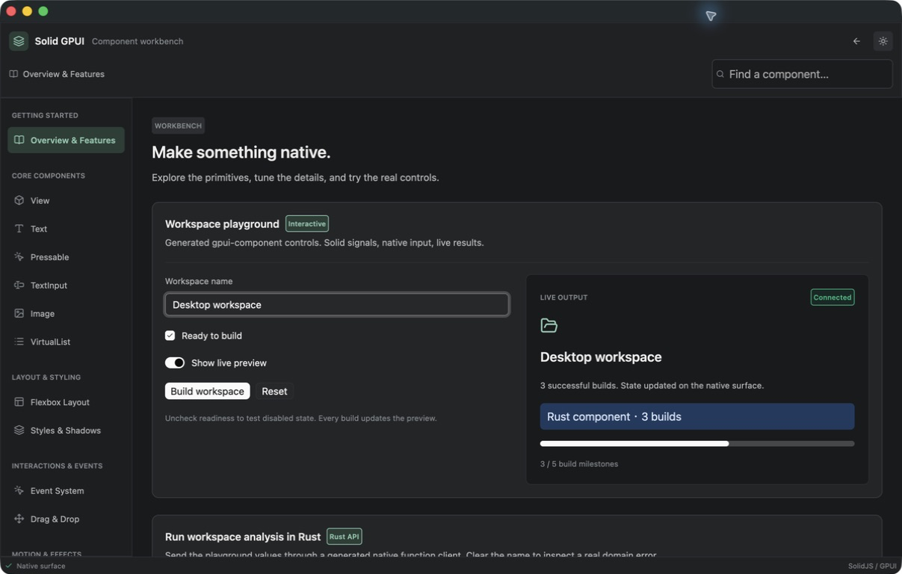

# React GPUI

> [!WARNING]
> **Early-stage WIP.** React GPUI is under active development. APIs, protocol
> details, and implementation behavior may change without notice; it is not
> production-ready.

React GPUI renders React trees into one or more native GPUI surfaces. React and
Bun own Fiber, hooks, context, fragments, and JavaScript closures; Rust and GPUI
own validated native tree state and drawing.



_The gallery example exercises native controls, scrolling, overlays, drag
reordering, and text rendering._

## Status

The V3 path is working end to end: the React custom renderer emits an immutable Snapshot bootstrap followed by incremental Patches, the Rust host validates and applies them, native press/TextInput/VirtualList/keyboard/animation events return to JavaScript listener callbacks, and the host can select either `ProcessAdapter` or the in-process `EmbeddedBunAdapter`. Embedded Bun builds the pinned Bun/JSC graph from `crates/react-gpui-bun/bun_embed.patch`; Fast Refresh lives in `packages/react-gpui-dev`.

TextInput supports muted visual-only `placeholder` guidance when native text is
empty; selection notifications carry UTF-16 ranges plus a `reversed` head
orientation bit, while ordered `setSelection(start, end)` remains an explicit
range command.

Single-line TextInput supports click-to-place, drag selection, UTF-16-safe
Shift+arrow/Home/End extension, and a visible selection highlight. The caret
remains always visible rather than blinking so keyboard focus and the insertion
point stay available to users who benefit from reduced visual timing demands.
Multiline TextInput now uses GPUI wrapped-line shaping for painting,
point-to-character mapping, and IME candidate bounds, including empty and
trailing-newline lines. The host keeps the caret and active marked range visible
by following them vertically (and horizontally for long single-line input),
without adding wire state. Ctrl/Cmd word-boundary movement and double-/triple-click
selection remain outside this renderer's minimal interaction contract.

TextInput editing also provides a bounded host-owned undo history without a
wire or GPUI API change. Cmd/Ctrl-Z undoes and Shift-Cmd-Z (or Ctrl-Y) redoes;
each operation emits the same change and selection events as ordinary edits,
so controlled inputs receive the reverted value through the normal
`onChangeText`/acknowledgement pipeline. The history keeps the newest 100
pre-edit snapshots and drops the oldest when full. Consecutive typing edits
coalesce only while both edits have a collapsed caret and the second edit
starts at the first edit's resulting caret; cursor moves, selection changes,
paste, cut, and word/line selection edits create boundaries without recording
selection-only changes. While IME marked text is active, undo first commits
the composition and then treats that committed composition as one undo entry.

`Text` owns one paragraph and may mix raw strings with one level of nested
`Text` runs:

```tsx
<Text style={{ color: "#334155", fontSize: 16 }}>
  Hello <Text style={{ color: "#2563eb", fontWeight: "bold" }}>world</Text>!
</Text>
```

Raw strings use the parent style. A nested run may override only
`color`, `fontWeight`, `fontStyle`, `textDecoration`, and `fontFamily`; its
`fontSize` and `lineHeight` (and layout or other non-typography fields) are
rejected because GPUI shapes one paragraph with one size and line height.
Nested runs are flattened into one UTF-8 paragraph for wrapping and
accessibility, while each run keeps its own color, font, weight, and decoration.
Selectable rich text is supported: selection and copy operate on the complete
flattened paragraph across run boundaries. A nested run with `onPress` is a
clickable link target and receives a native focus handle/tab stop; focus and
blur use the existing callbacks, and unmodified Enter synthesizes `onPress`.
Space remains non-activating. Listener-bearing runs own the pointing-hand
cursor only over their shaped glyph range through GPUI's native InteractiveText
decision; when a paragraph has such runs, its node-level cursor style is
intentionally ignored so sibling text keeps the surrounding cursor.
The complete rich-text showcase is [`packages/react-gpui/examples/rich-text.tsx`](packages/react-gpui/examples/rich-text.tsx), including nested styles, interactive link runs, and native selection/copy across run boundaries.

## Platform support

The supported process-mode host targets are intentionally explicit:

| Target            | Process-mode status          | Validation and remaining scope                                                                                                                                                                                      |
| ----------------- | ---------------------------- | ------------------------------------------------------------------------------------------------------------------------------------------------------------------------------------------------------------------- |
| macOS ARM         | Validated candidate          | The Cocoa/AppKit + Metal host is covered by the current macOS gates; process mode uses an external renderer command.                                                                                                |
| Linux Wayland/X11 | Feature-enabled build target | The host enables both GPUI backends. Ubuntu CI runs locked checks, Clippy, and platform-neutral protocol tests; display-backed WGPU smoke and compositor/portal/font/GPU validation remain pending on real runners. |
| Windows           | Build target                 | Windows CI runs a locked workspace check and process-host build with the hosted Windows SDK/FXC toolchain; display-backed D3D11, text, input, accessibility, and swap-chain smoke remains pending.                  |
| Embedded Bun      | macOS-only by design         | The current Bun/JavaScriptCore build rejects non-macOS targets. Linux and Windows process mode still require an externally supplied renderer; no embedded-Bun support is claimed there.                             |

Linux and Windows entries describe build coverage, not release artifacts or
display-backed runtime support.

## Architecture

```text
React components and hooks
          │
          ▼
@react-gpui/core (Bun/TypeScript)
  Fiber commit → one framed MessagePack Commit Batch per surface
          │ stdout commits / stdin events
RuntimeAdapter (`ProcessAdapter` or `EmbeddedBunAdapter`)
          │
          ▼
Surface registry + one commit reader
  ├── surface 1 → ReactRoot → GPUI window
  ├── surface N → ReactRoot → GPUI window
  └── events/CommandResults demultiplexed by surfaceId
          │
          └── native events → framed events → matching JS root callback
```

A host starts with surface `1`. For multiple native windows, construct a
shared `createSurfaceHost(transport)`, render from one registered root, then
call that root's `openSurface({ title?, width?, height?, kind?, resizable?, minSize? })`.
Await the returned surface ID, register it with `host.createRoot({ surfaceId, onClose })`,
and render the new tree:

```tsx
const host = createSurfaceHost(transport);
const root = host.createRoot({ surfaceId: 1 });
root.render(<Main />);
const surfaceId = await root.openSurface({
  title: "Inspector",
  width: 640,
  height: 480,
  kind: "floating",
  resizable: false,
  minSize: [320, 240],
});
const inspector = host.createRoot({ surfaceId, onClose: () => console.log("closed") });
inspector.render(<Inspector />);
```

Creation options map to GPUI's `WindowKind`, creation-time resizable flag, and
minimum size. `"floating"` is above-parent where supported, not a portable
global always-on-top guarantee; popup, max-size, runtime option setters, and a
center toggle remain unsupported. The host's initial window is a centered
`800×600` surface created before JavaScript starts.
Root window controls are root-scoped and asynchronous:

```tsx
await root.minimizeWindow();
const bounds = await root.getWindowBounds();
const state = await root.getWindowState();
await root.activateWindow();
```

`getWindowBounds()` returns finite logical/global `[x, y, width, height]`
coordinates; on macOS the origin is screen-relative global top-left. The
state read returns `{ fullscreen, maximized }`, while `EVENT_WINDOW_ACTIVATION`
remains the activation observation channel. For persistence, save bounds and
restore the saved size with `openSurface({ width, height })`; creation remains
centered because the pinned GPUI public API has no runtime or creation-position
setter, so exact position restoration is an upstream boundary. Minimize and
activation have visible effects only on a display-backed host; the pinned
headless TestWindow leaves minimize unimplemented and reports inactive state.

`OpenSurface` is always a command from its requesting, already registered root
(`nodeId=1`); the host rejects unknown surface IDs and never implicitly opens a
window. A native close emits `EVENT_SURFACE_CLOSED` before teardown, routes only
to that root, and invokes its `onClose`. Closing the last native window shuts
down the runtime and process. Real Quartz multi-window display behavior is
validated separately on a macOS display-backed host; headless tests cover the
shared-reader/demultiplexing contract.

File dialogs are root-scoped asynchronous commands:

```tsx
const paths = await root.pickFiles({ title: "Choose files", multiple: true });
const savePath = await root.pickSavePath({ defaultName: "report.json" });
```

`pickFiles` chooses files or directories exclusively (`directories` selects
directories; `multiple` controls multiplicity) and resolves to a non-empty
path list or `null` on cancellation. `pickSavePath` returns a selected path or
`null`; an empty default name leaves the native suggestion unset. Save dialog
titles are not exposed because GPUI's raw save picker has no title/prompt
parameter. Picker failures reject the JavaScript promise. The file dialog
commands remain asynchronous so the GPUI event loop and other root commands
continue while the native modal is open.
Headless tests cover command validation, asynchronous completion, cancellation,
and value routing. Actual NSOpenPanel/NSSavePanel interaction requires a
display-backed macOS Quartz host run and is not exercised in headless CI.
Text-file persistence is also root-scoped and asynchronous:

```tsx
const text = await root.readTextFile(path);
const bytesWritten = await root.writeTextFile(path, text);
```

Both methods require a non-empty absolute path with no control characters and
at most 1024 UTF-8 bytes. File content is UTF-8 and bounded to the frame-safe
`MAX_FRAME_SIZE - 1024` bytes; reads reject directories, oversized files, and
invalid UTF-8, while writes return the number of UTF-8 bytes written. Native
filesystem failures reject the Promise. Applications commonly obtain paths
from the file dialogs above; symlink handling follows ordinary host filesystem
semantics rather than an additional sandbox policy. See
`packages/react-gpui/examples/notes.tsx` for an end-to-end editor.

Clipboard images are available through the root-scoped asynchronous API:

```tsx
await root.setClipboardImage({ format: "png", bytes: pngBytes });
const image = await root.getClipboardImage();
```

The bounded interchange preserves encoded PNG, JPEG, GIF, or SVG bytes and
uses a payload cap below the 16 MiB frame limit. `getClipboardImage()` returns
`null` when the clipboard has no image. Native image clipboard support is
currently honest about platform capability: macOS and Windows use GPUI's
native image entries; X11 and Wayland reject image writes/reads as
`platform-unsupported` rather than silently converting them to text. The
protocol does not promise RGBA conversion or format transcoding.

System notifications and static menus are root-scoped integrations:

```tsx
await root.showNotification({ title: "Build finished", body: "Artifacts are ready." });
await root.setMenus([
  {
    title: "File",
    items: [
      { type: "action", name: "open", disabled: !canOpen, checked: isOpen },
      { type: "separator" },
      { type: "submenu", title: "More", items: [{ type: "action", name: "other" }] },
    ],
  },
]);
```

Optional notification actions use bounded `{ id, label }` pairs (at most three).
Register `onNotificationResponse: ({ tag, actionId }) => ...` in root options;
`actionId` is `null` for body activation, and responses for closed surfaces are
dropped. Notification delivery and response support are platform best effort.

Pass `onAction: (action) => ...` in `createRoot` options to receive the
selected string action. Menu state is static and state-driven: changing
`disabled` or `checked` re-sends the complete `setMenus` definition; omitted
flags default to `false`, and there is no incremental menu-state command.
`root.setKeybindings` uses full-replacement bindings such as
`{ keystrokes: "cmd-shift-p", actionName: "palette.open" }`; multiple chords
are separated by ASCII whitespace (for example, `"ctrl-k ctrl-1"`). The host
retains each surface's set, installs their union in the process-global GPUI
keymap, and routes a match to the active surface through the same `onAction`
callback. Context predicates and menu shortcut fields are not part of this
first API; invalid chords reject without replacing the previous set.
Disabled actions are unavailable to native activation, while checked actions
use GPUI's toggled indicator. Notifications are fire-and-forget platform
submissions: delivery and authorization are not guaranteed, Web/test menu
implementations may be no-ops, and Windows AppUserModel identity remains a
host packaging concern.

## Public API

The `Root` returned by `createRoot` or `host.createRoot` exposes 29 methods:

| Area               | Methods                                                                                                                                                                                        |
| ------------------ | ---------------------------------------------------------------------------------------------------------------------------------------------------------------------------------------------- |
| Rendering          | `render(element)`, `unmount()`                                                                                                                                                                 |
| Window             | `setTitle(title)`, `resize(width, height)`, `getWindowSize()`, `minimizeWindow()`, `getWindowBounds()`, `getWindowState()`, `activateWindow()`, `zoom()`, `toggleFullscreen()`, `openUrl(url)` |
| Surfaces and focus | `openSurface(options?)`, `focusNext()`, `focusPrev()`                                                                                                                                          |
| Close policy       | `setClosePolicy(policy)`, `resolveCloseRequest(requestId, allow)`                                                                                                                              |
| Clipboard          | `setClipboardText(text)`, `getClipboardText()`, `setClipboardImage(image)`, `getClipboardImage()`                                                                                              |
| Files and fonts    | `pickFiles(options?)`, `pickSavePath(options?)`, `readTextFile(path)`, `loadFont(path)`, `writeTextFile(path, content)`                                                                        |
| OS integrations    | `showNotification(options)`, `setMenus(menus)`, `setKeybindings(bindings)`                                                                                                                     |

Command methods return promises. `getWindowSize()` returns `[width, height]`,
`getWindowBounds()` returns `{ x, y, width, height }`, `getWindowState()` returns
`{ fullscreen, maximized }`, `openSurface()` returns a surface ID, file pickers
return paths or `null`, `loadFont()` returns the metadata family,
`writeTextFile()` returns the UTF-8 byte count, and `getClipboardImage()`
returns encoded image bytes or `null`. `createSurfaceHost(transport, options?)`
adds `host.createRoot(options?)` and `host.dispose()` for shared transport
routing. See the package [Root API inventory](packages/react-gpui/README.md#root-api-inventory)
for return values, constraints, and component ref handles.

A commit reader performs blocking process I/O away from the GPUI foreground executor, then applies each complete Commit Batch on the GPUI side. GPUI rebuilds ephemeral elements from the retained `NodeStore`; native callbacks send events through the same adapter. ProcessAdapter outbound events are drained by a named writer thread with an ordered queue bounded to 32 payloads and 16 MiB of queued payload bytes; full bounds fail immediately, while writer I/O failures are retained, request child stop, and on confirmed child death wake the commit reader for the host fatal path. Shutdown joins the writer only after child exit is confirmed; kill/wait errors return without blocking. StdioTransport input/output end, close, and error signals notify createRoot termination callbacks, and process examples exit nonzero through the injectable termination handler. Unexpected runtime EOF, framing, commit-validation, or outbound Native Event/CommandResult send errors are logged with context, stop the runtime, close the application, and return a nonzero CLI status; explicit application shutdown remains clean.

## VirtualList scroll persistence

`VirtualList` exposes a ref handle for preserving the native logical-pixel
scroll position across a remount or data refresh. Read the current offset and
restore it after the list has mounted:

```tsx
const listRef = useRef<VirtualListHandle>(null);
const savedOffset = await listRef.current?.getScrollOffset();
await listRef.current?.scrollToOffset(savedOffset ?? 0);

<VirtualList
  ref={listRef}
  data={rows}
  itemKey={(row) => row.id}
  renderItem={(row) => <Text>{row.title}</Text>}
  estimatedItemSize={32}
/>;
```

Offsets are logical layout pixels (not item indexes or device pixels).
`scrollToOffset` accepts finite, non-negative values; the native list clamps a
value beyond the content range, so a subsequent `getScrollOffset()` returns
the effective clamped position. A write before the first native layout is
accepted but has no effect; restore after the list has rendered once.

## Pointer movement

`View` and `Pressable` can opt into native pointer-coordinate streaming with
`onPointerMove`. The callback receives finite logical window pixels and the
currently active modifiers:

```tsx
<View
  onPointerMove={({ x, y, modifiers }) => {
    setCursor({ x, y, modifiers });
  }}
/>
```

Moves are registered only for nodes that provide the handler, so ordinary
nodes do not pay for native move listeners or event frames. Coordinates are
clamped to the viewport by the host; the event does not expose button state.
`onHoverChange` remains a null-payload edge notification, and drag-over
notifications remain a separate drag path rather than pointer-move events.

## Quick start

From the repository root, the gallery is the recommended first run. For a new
consumer application, follow [getting started](docs/getting-started.md), which
covers the pinned Bun/Rust versions, local package install, host command, and a
small TextInput/VirtualList app.

Until `@react-gpui/core` is published to npm, a consumer must build and pack
the package from a repository checkout, then install the resulting tarball:

```sh
cd packages/react-gpui
bun install --frozen-lockfile
bun run build
bun pm pack --destination /tmp/react-gpui-package --quiet
```

Run `bun add react file:/tmp/react-gpui-package/react-gpui-core-0.2.0.tgz`
from the consumer app directory. After publication, `bun add react
@react-gpui/core` is sufficient. The package export points at generated
`dist/` files, so the build must precede packing. See the
[installation troubleshooting entry](docs/troubleshooting.md#package-installation-returns-404)
if the registry command fails before publication.

### Gallery (embedded Bun/JSC)

```sh
cargo run -p react-gpui-host --features embedded-bun -- \
  --runtime embedded \
  packages/react-gpui/examples/gallery.tsx
```

The first embedded build compiles the pinned Bun/JSC source graph under
`target/`.

### Counter (process runtime)

```sh
cargo run -p react-gpui-host -- \
  --runtime process -- \
  bun run packages/react-gpui/examples/counter.tsx
```

The `--` before `bun` passes the renderer command to the host unchanged. A
renderer script run by itself does not create a native surface.

For opt-in Fast Refresh while developing an embedded entry, add `--watch`
before the entry path:

```sh
cargo run -p react-gpui-host --features embedded-bun -- \
  --runtime embedded \
  --watch \
  packages/react-gpui/examples/gallery.tsx
```

## Workspace map

- `crates/react-gpui-bun/` — bounded in-process Bun/JSC adapter and pinned source patch/build.
- `packages/react-gpui-dev/` — Babel React Refresh transform, runtime globals, family refresh, and last-good failure handling.
- `crates/react-gpui-host/` — executable host with explicit ProcessAdapter/EmbeddedBunAdapter selection.
- `packages/react-gpui/` — TypeScript package `@react-gpui/core`, custom React renderer, transports, tests, and counter example.
- `crates/react-gpui/` — Rust protocol, runtime adapter seam, snapshot validation, retained node store, and GPUI rendering entity.
- `references/zed/` — checked-in GPUI reference source used by the workspace.
- `docs/adr/` — architecture decision records for protocol, runtime, and native-boundary choices.
- `docs/agents/` — contributor conventions for domain vocabulary, issue tracking, and triage.

## V3 protocol and ownership invariants

- The authoritative wire reference is [`docs/protocol.md`](docs/protocol.md). It defines framing, Snapshot/Patch/Event/Command tuples, node and style slots, validation, fixtures, and evolution rules.
- Every message is a four-byte little-endian payload length followed by MessagePack bytes; payloads are bounded at 16 MiB. A completed React commit is one atomic Commit Batch: Snapshot bootstrap, then Patch revisions.
- React/Bun own Fiber, hooks, closures, and callback state. Rust/GPUI owns validation, the retained tree, native input/focus/window state, and native rendering. Runtime adapters carry only the versioned wire exchanges.
- Native events and surface commands are semantic boundaries; their complete code directories, ownership, payloads, and CommandResult value tags are maintained in `docs/protocol.md` rather than duplicated here.
- Protocol fixtures and golden tests lock producer bytes and cross-language meaning; use `make protocol-golden-generate` when changing the contract.

## Development commands

The local one-shot verification entry point is the same command used by the
ordinary CI jobs:

```sh
make ci
```

`make ci` runs Rust formatting, a locked Rust workspace check, strict Clippy
with warnings denied, and tests, then formatting, typechecking, tests, clean
package builds, tarball content checks, and an external tarball consumer smoke
test for both Bun packages. Each package uses its checked-in `bun.lock` with
`bun install --frozen-lockfile`; the formatter is the pinned Prettier `3.6.2`
dependency and the Bun runtime is pinned to `1.4.0` by `.bun-version`. The Rust
toolchain is pinned in `rust-toolchain.toml`.
The ordinary CI workflow also runs `make host-release-check` as an independent
macOS ARM release-bundle job, so CLI parsing and archive checks run on pull
requests rather than only in the manual candidate workflow.

The individual local gates are also available when iterating:

```sh
make rust-format
make rust-check
make bun-build
make bun-pack-smoke
make bun-ci
```

The core and development package public export names are locked by
`fixtures/api-surface.core.txt` and `fixtures/api-surface.dev.txt`; the locks
cover value/type names, not internal type structure. If an API surface test
fails, review the change and explicitly regenerate both snapshots with:

```sh
make api-surface-generate
```

The embedded Bun build is intentionally not part of `make ci` because it
clones and compiles the pinned Bun/JSC source graph. Run its locked host
feature check, representative example startup matrix, Fast Refresh lifecycle
probe, and embedded adapter tests explicitly with:

```sh
make embedded-bun
```

The gate loads the gallery, text-input, virtual-list, and notes entries through
`EmbeddedBunAdapter`, checks protocol-v3 Snapshot startup contracts and known
signals, and verifies that a queued refresh keeps the runtime alive. It is a
bounded transport/lifecycle check rather than a duplicate of process-mode
display and interaction coverage; native painting, IME, file pickers, and
actual asynchronous file command completion remain display-backed boundaries.

The ordinary CI workflow runs on the GitHub-hosted `macos-15` ARM runner.
The independent embedded-Bun workflow is manually dispatchable and only
automatically considered for pull requests touching its inputs; it uses the
`macos-26` ARM runner because the pinned Bun/JSC build requires the macOS 26
SDK/toolchain.

For direct package work, the equivalent commands are:

```sh
cd packages/react-gpui
bun install --frozen-lockfile
bun run format
bun run typecheck
bun run test
bun run build
bun pm pack --dry-run

cd ../react-gpui-dev
bun install --frozen-lockfile
bun run format
bun run typecheck
bun run test
bun run build
bun pm pack --dry-run
```

### Host release candidate

The release candidate is the default process-runtime host for macOS ARM. It
does not bundle Bun or a renderer entry: users still need Bun and a renderer
command/entry such as `bun run packages/react-gpui/examples/counter.tsx`.

Build and verify the staged candidate locally:

```sh
make host-release-bundle
make host-release-check
```

To rehearse a real user consuming the extracted binary, run:

```sh
make host-candidate-smoke
```

This extracts the archive, launches the extracted host against the repository
counter as a user-supplied renderer entry from a fresh working directory, and
requires a Snapshot frame, the 5-second timeout exit `124`, startup info
diagnostics, `--help`, and `--version`. It does not claim to validate window
pixels on a display-less environment.

The embedded runtime has a separate, non-publishing rehearsal:

```sh
make host-embedded-candidate-smoke
```

It builds the embedded host release binary on the macOS 26 SDK/toolchain,
runs the extracted-style binary from a fresh directory with the counter entry,
and checks the in-process Snapshot commit count, info diagnostic, timeout
`124`, `--help`, and `--version`. It is an exercise rather than a release
archive: embedded package inclusion remains a ready-for-human release-matrix
decision tracked in `.scratch/release-productionization/issues/03-embedded-build-coverage.md`
and `.scratch/release-productionization/issues/06-cross-platform-host.md`.

Before a candidate release, synchronize the workspace and package versions
from one Cargo version with a matching `CHANGELOG.md` section:

```sh
make release-prep VERSION=0.1.1
```

This updates the workspace Cargo/package manifests, refreshes Cargo and Bun
locks, and verifies frozen installs. It is idempotent when all three manifests
already use the requested version; it never creates or edits a changelog
section. The manual `Release Prep` workflow runs this step, then `make ci`,
and packs tarballs as verification artifacts only. Actual npm/crates.io
publication still requires a human, an approved version/changelog, and real
registry credentials; this workflow contains no publish step or secrets.

Host diagnostics are controlled by `REACT_GPUI_LOG=off|error|info|debug`;
the default is `error`, and invalid values fall back to `error` with one
warning. `info` adds startup and runtime-termination status lines, while
`debug` preserves those diagnostics alongside existing fatal context.

The `info` startup diagnostic includes `protocol=v3`, and `--version` reports
the host package version together with the same protocol version. Include that
line in support reports so host and renderer compatibility can be checked before
examining a crash.

The archive is written to `dist/` as
`react-gpui-host-<cargo-version>-<target>.tar.gz` and contains only the
release host binary, `README.md`, `LICENSE`, and `SHA256SUMS`. The check
extracts it into a new temporary directory, validates the allowlist and
checksums, verifies executable permissions, and runs `--help` and `--version`
without starting GPUI or requiring a display. The archive includes per-file
SHA-256 checksums for extracted-file consistency. `host-release-check` creates
two archives from the same staged payload and requires their SHA-256 values to
match; this empirically proves deterministic stage-to-archive output for that
candidate. It does not claim full build reproducibility across fresh compiler
runs or different archive tool versions. The archive is unsigned.

The manual `Host Release Candidate` workflow runs the ordinary `make ci` gate
before bundling and uploads this unsigned candidate as a short-retention
artifact; it does not publish a GitHub Release or package.

## Debugging

For symptom → diagnosis → repair workflows, start with the
[Troubleshooting guide](docs/troubleshooting.md). This section keeps the
environment-variable quick reference; see the guide for failure-mode lookup:

- `REACT_GPUI_LOG=off|error|info|debug` controls host diagnostics (`error` is
  the default; invalid values fall back to `error` with one warning).
- `REACT_GPUI_TAP=/path/to/file.jsonl` enables process-local protocol metadata;
  use a distinct path for each process and summarize it with
  `python3 scripts/protocol-tap-report.py`. The JSON report includes
  `frames_by_kind`, overall and patch byte rates, a one-second frame/byte
  `timeline`, a byte-size histogram, event-type counts, and malformed-frame
  counters.
- `REACT_GPUI_CRASH_DIR=/path/to/directory` chooses where the host panic hook
  writes `react-gpui-host-<pid>-<timestamp>.log`; it defaults to the system
  temporary directory.

The tap records frame metadata rather than payload contents and is not a
GPU/layout profiler. `malformed_frames` counts records classified as unknown by
the metadata classifier; `malformed_records` counts invalid JSON/object/timestamp
lines skipped by the report. The report cannot observe transport queue depth or
backpressure, and `REACT_GPUI_LOG=debug` does not currently emit per-commit
timings. Those are future instrumentation seams, not claims made by the tap.

Rates use the elapsed time between the first and last actual frame; the
synthetic `tap_stopped` capacity marker is excluded from frame rates and
timeline buckets.

The guide explains the separate host/renderer tap setup, the bounded
`make soak-smoke` leak smoke, crash/stderr correlation, and known platform
boundaries.

The tap overhead claim is a one-time 10,000 seven-byte snapshot microbench:
tap-off 18.03 ms versus tap-on 33.65 ms, or about 1.56 μs of incremental wall
time per frame. The later event-storm audit measured renderer commit cost with
the tap disabled; it did not re-measure tap-on overhead, so this figure is
informational rather than a current performance guarantee.

## Crash diagnostics reference

The host installs a standard-library panic hook before CLI/runtime startup.
Crash reports are written to
`${REACT_GPUI_CRASH_DIR:-the system temporary directory}` as
`react-gpui-host-<pid>-<timestamp>.log`; the original panic remains on stderr.
The report includes the host version/platform, panic location, and a
`Backtrace::capture()` result. Reproduce with:

```sh
RUST_BACKTRACE=full REACT_GPUI_CRASH_DIR=/tmp/react-gpui-crashes \
  cargo run -p react-gpui-host -- --runtime process bun run path/to/entry.tsx
```

For an optional APM integration, initialize the provider before the host's
standard hook and preserve the existing hook when adding the provider. This
illustrative snippet uses the optional Sentry Rust SDK but adds no dependency
to this repository:

```rust
let _sentry = sentry::init(("https://example.invalid/project", sentry::ClientOptions::default()));
let previous = std::panic::take_hook();
std::panic::set_hook(Box::new(move |info| {
    sentry::capture_message(&info.to_string(), sentry::Level::Error);
    previous(info);
}));
```

Use a distinct `REACT_GPUI_TAP` path for each process and run
`scripts/protocol-tap-report.py` beside the crash report. The tap records frame
metadata only, while the crash file records panic context; their timestamps,
direction, and message/subtype sequence provide the non-payload correlation
needed to localize a failure without persisting payload contents.

V3 supports the documented native host kinds, protocol-v3 press/TextInput/VirtualList/keyboard/pointer/hover/scroll/animation notifications, transitions, and accessibility fields. It does not provide synchronous native cancellation, arbitrary native widgets, or a browser/DOM compatibility layer. `ProcessAdapter` remains the default for fast iteration; `EmbeddedBunAdapter` is available with `--features embedded-bun` and is built from the pinned Bun source graph. Fast Refresh failures keep the last-good native tree visible and print an actionable stderr diagnostic.
